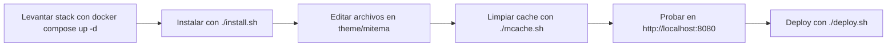

# Desarrollo local de temas en Moodle 4.4

Este repo ya tiene el flujo base para trabajar un tema custom sin tocar la rama core.



## Estructura

```text
moodle-dev/
├── docker-compose.yml
├── install.sh
├── deploy.sh
├── mcache.sh
├── theme/
│   └── mitema/
└── moodle-data/
    ├── db/
    └── moodledata/
```

`moodle-data/` queda excluido localmente por `/.git/info/exclude`.
El checkout completo de esta rama se monta en el contenedor, asi que cualquier cambio en `theme/mitema/` impacta directo sobre el Moodle local.

## Levantar el entorno

```bash
docker compose up -d
./install.sh
docker compose logs -f moodle
```

Abrir `http://localhost:8080` y entrar con `admin / Admin1234!`.
`install.sh` deja `mitema` activado como tema por defecto.

## Hot reload

Cada cambio en `theme/mitema/` se refleja en caliente. Despues de tocar SCSS o plantillas:

```bash
./mcache.sh
```

Si queres mantener el alias de la guia:

```bash
alias mcache='$PWD/mcache.sh'
```

## Deploy

El script usa variables de entorno para no hardcodear tu servidor:

```bash
DEPLOY_HOST=usuario@143.255.142.201 ./deploy.sh
```

Opciones utiles:

```bash
THEME_NAME=mitema \
DEPLOY_HOST=usuario@143.255.142.201 \
REMOTE_THEME_DIR=/var/www/moodle/theme/mitema \
REMOTE_PURGE_CMD='sudo -u www-data php /var/www/moodle/admin/cli/purge_caches.php' \
./deploy.sh
```

## Resumen rapido

| Accion | Comando |
| --- | --- |
| Levantar dev | `docker compose up -d` |
| Instalar Moodle | `./install.sh` |
| Ver logs | `docker compose logs -f moodle` |
| Limpiar cache | `./mcache.sh` |
| Hacer deploy | `DEPLOY_HOST=usuario@host ./deploy.sh` |
| Bajar todo | `docker compose down` |

## Nota sobre la imagen

El compose usa por defecto `moodlehq/moodle-php-apache:8.2`, que encaja bien con Moodle 4.4 para desarrollo local. Si queres cambiarla:

```bash
MOODLE_IMAGE=moodlehq/moodle-php-apache:8.3 docker compose up -d
```